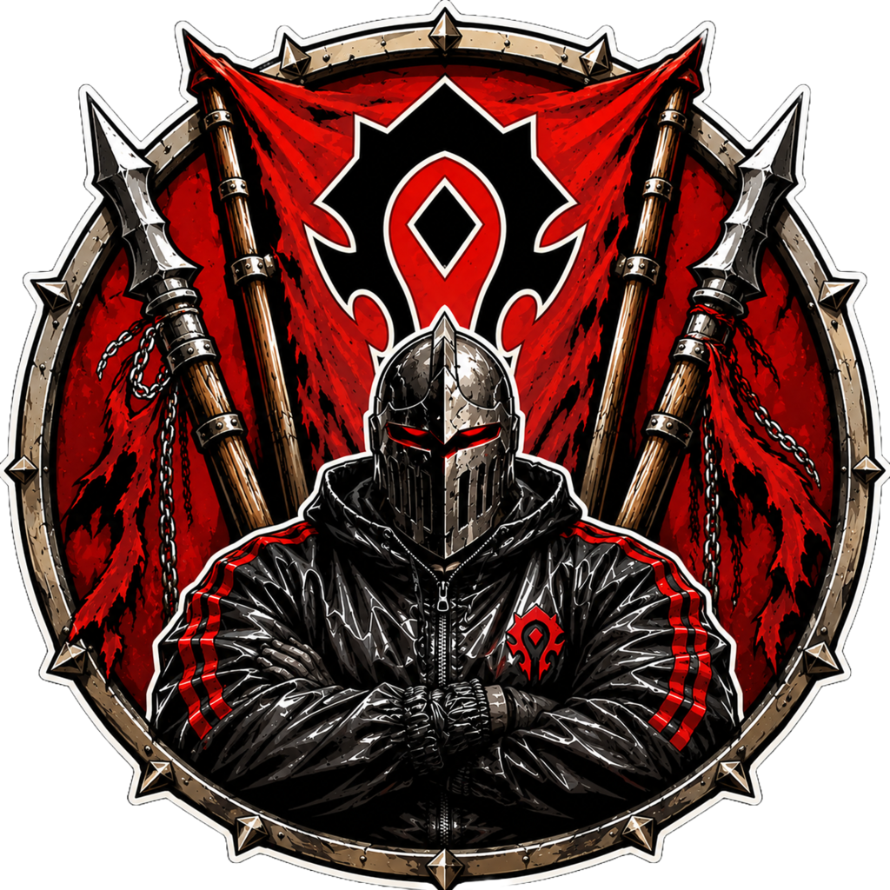

  

<h1 align="center">🛡️ Ortalion M+ (GigaKloce)</h1>

Addon do organizacji **Mythic+** dla ekipy — World of Warcraft **7.3.5 (Legion)**, serwer **Tauri** (realmy połączone: Tauri + Evermoon).

TL;DR: zapisujesz graczy, których chcesz unikać (**Kloce**) i tych sprawdzonych (**Chady**), w jednym widoku **Active** widzisz klucze i online całej ekipy — **nawet z różnych gildii** — budujesz składy z presetów, a wszystko **synchronizuje się po cichu** między osobami z addonem.

---

## ✨ Co potrafi

### 📑 Zakładki: **Active · Kloce · Chady**

**🟢 Active** — jeden widok „kto jest w okolicy": **wszyscy z addonem + wszystkie klucze M+** (auto-rozsyłane co 30 s).
- **Twój skład na górze** jako `Party (N)` (a gdy grasz sam — `Me`), reszta **pogrupowana po gildii** (nagłówki Z→A, „No Guild" na końcu).
- Osoba z kluczem: ikona klasy, **ilvl**, podziemie + poziom klucza, gildiowa **notatka publiczna**. Osoba bez klucza — sam nick (kolor klasy).
- **Hover** = strefa + typ instancji (M+/raid/BG/arena) — leci z presence, więc **widać to też u osób bez klucza**.
- **Prawy klik na osobie** = menu: zawsze **Invite / Whisper**; dla osób z addonem (gdy jesteś adminem) dodatkowo flagi/most/announce; **Kick** gdy są w Twojej grupie.

**🎛️ Toggle „Preset"** (przycisk po prawej) — pokazuje/chowa panel presetu (dropdown z nazwą, **Invite all**, lista członków).
- **Lewy klik na osobie w Active** → dodaje ją do bieżącego presetu.
- **Lewy klik na członku presetu** → usuwa z presetu.
- Preset = zapis „z kim chcę grać" + późniejszy auto-invite (**Invite all**).

**👥 Toggle „Party"** (tylko **admin/Alvcard**) — grupuje listę Active w **drużyny** („*<lider>'s group*"), widać kto z kim aktualnie gra (skład wysyłany w presence, max 5). Osoby bez addona pokazują się jako sam nick.

**🧱 Kloce** — gracze do unikania. Tag (`noob`/`leaver`/`debil`/`ninja`), notatka „za co", klasa/spec, ikona. Klik → okno **Details**. Po prawej panel **In Group** (kto ze składu jest klocem/chadem) z przyciskiem **Kick**.

**😎 Chady** — sprawdzeni gracze (klasa/spec + notatka).

### ⌨️ Podpowiedzi przy dodawaniu
W polu **Add** (Kloce/Chady) podpowiedzi z **ostatnio granych razem** osób, pokolorowane wg klasy. Klik = wpis od razu z **klasą i specem**.

### 🚨 Alerty
- Gdy **kloc** trafi do Twojej grupy → dźwięk + popup z opcją kicka + **pulsująca ikonka** przy minimapie.
- Wiadomości na czacie: `[KLOC]` (czerwony) / `[CHAD]` (niebieski) przy autorze.

### 🖱️ Menu kontekstowe
- **Alt + lewy klik** na dowolnym graczu (świat, ramka party/target) → własne menu: *Add to Kloce*, *Block guild*, *Add to Chads*.
- **Prawy klik na nicku w czacie** → Blizzardowe menu z dodatkową pozycją **„Invite to guild"** (gdy masz uprawnienia).

> Dlaczego Alt+lewy do naszego menu? Wstrzykiwanie do menu jednostki Blizzarda „brudzi" (taint) i losowo psuło chronione *Set Focus/Target*. Własne menu na Alt+lewy tego nie rusza.

### 📣 Global advert (tylko admin)
Automatyczne ogłoszenie o gildii na kanale **global**, co 15 min (pierwsze po 15 min, nie na wejściu). **Tekst i włącznik są wspólne** — synchronizowane między adminami (ostatnia zmiana wygrywa). Gdy jeden admin rozgłosi, pozostali pomijają swój cykl (bez dubla na kanale). Sterowanie w **zębatce** (admin): *Enabled*, *Set advert text…*, *Broadcast now*.

### 🚫 Blokowanie gildii
Lista zakazanych gildii. Gdy ktoś z takiej gildii **zaaplikuje do Twojego premade**, addon po cichu robi `/who`, sprawdza gildię i **automatycznie dodaje go na Kloce**.

### ♻️ Reparty / Resync
W menu zębatki: **Reparty** (lider rozwala i odbudowuje skład — osobom z addonem invite auto-akceptuje się) oraz **Resync** (wymuszenie pełnej synchronizacji).

---

## 🔄 Synchronizacja (cross-guild)
Tauri **nie przepuszcza addon-message po custom kanale**, więc transport jest podzielony:

| Co | Czym | Zasięg |
|---|---|---|
| **Listy** Kloce/Chady/detale/gildie | kanał gildii (addon) | w obrębie gildii |
| **Presence + klucze + strefa + skład drużyny** | wspólny, ukryty kanał czatu `OrtalionMplusSync` | **cross-guild** |
| **Global advert** (config + dedup) | kanał gildii (addon) | w obrębie gildii (per admin) |
| **Most pełnego stanu / flagi / announce** | szept (addon) | **cross-guild**, ręczny |

W **Active** widać też ludzi z **innych gildii** (z nazwą gildii przy nicku). Synchronizacja list: **„ostatnia zmiana wygrywa"** ze znacznikami czasu i „nagrobkami" — **usunięcia nie wracają**.

- **Accept sync from others** (zębatka) — wyłącza przyjmowanie zmian od innych.
- **Flagi admin/blocked** — admin nadaje **szeptem do celu** (działa cross-guild); *blocked* = ktoś nie wysyła swoich zmian.
- **🌉 Most cross-guild** (super-admin): `pull` / `push` / `forceshare` — przez szept.
- **📨 Guild-announce** — admin każe klientowi z innej gildii wrzucić treść na czat **jego** gildii (`/kloce announce` lub prawy klik → *Announce to their guild…*); obsługuje wklejanie linków (shift-klik).

## 🧬 Wersjonowanie danych (`DATA_VERSION = 4`)
Sync **list** przyjmowany tylko od **zgodnej wersji**. Nowe pola (strefa, skład drużyny) i nowe typy wiadomości (advert, „invite to guild") są **dodatkowe** — starsze klienty v4.x je ignorują, więc v4.x są **wzajemnie zgodne**. Wersja widoczna przy nickach — **czerwona = nieaktualny klient**. Po update **wszyscy robią `/reload` razem**.

## 💾 Backup (snapshoty)
Codzienny automatyczny backup (max 10, rolling) — Kloce, Chady, detale, gildie, presety. Przywracanie z zębatki → **Import snapshot**.

---

## ⚙️ Komendy
| Komenda | Opis |
|---|---|
| `/kloce show` | otwórz okno |
| `/kloce add/remove <nick>` | dodaj/usuń kloca (lub na targecie) |
| `/chad add/remove <nick>` | dodaj/usuń chada |
| `/kloce guild add/remove/list <nazwa>` | blokowane gildie |
| `/kloce announce <nick> <treść>` | wyślij ogłoszenie na czat gildii odbiorcy (admin) |
| `/kloce reparty` | odbuduj skład (tylko lider) |
| `/kloce share` | wypchnij wszystko do ekipy |
| `/kloce sync` | ręczny pull od źródła z własnej gildii |
| `/kloce syncfrom <nick\|auto>` | preferowane źródło auto-pulla |
| `/kloce pull/push/forceshare <nick>` | most cross-guild (super-admin) |
| `/kloce reset` | reset pozycji/rozmiaru okna |

## 📥 Instalacja
1. Wrzuć folder **`GigaKloce`** do `Interface/AddOns`.
2. **Po pierwszej instalacji przeloguj się** (sam `/reload` nie wczyta nowego addona).
3. Cała ekipa na **tej samej wersji** — po update zróbcie `/reload` razem.
